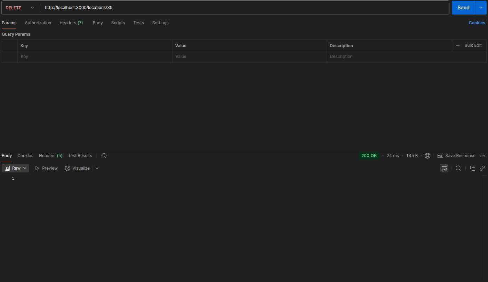

# Location Tree Management API

This project provides a RESTful API for managing hierarchical locations using NestJS, TypeORM, and PostgreSQL.

---

## Technologies Used

- Backend: NestJS + TypeScript
- Database: PostgreSQL
- ORM: TypeORM
- Logging: Winston
- API Documentation: Swagger
- Docker

---

## Features

- CRUD operations for hierarchical locations.
- Validation and error handling.
- Logging with `winston`.
- Swagger API documentation.

---

## Setup Instructions

### Prerequisites

- Node.js (v16 or higher)
- Docker and Docker Compose
- PostgreSQL (if not using Docker)

### Steps

1. **Clone the repository**:

   ```bash
   git clone https://github.com/hokhacminhtri/nodejs-location-tree-management
   cd nodejs-location-tree-management
   ```

2. **Install dependencies**:

   ```bash
   npm install
   ```

3. **Start PostgreSQL using Docker**:

   ```bash
   docker-compose up -d
   ```

4. **Run the seeder.ts file to import sample data into the database.**

   ```bash
   npx ts-node src/seeder.ts
   ```

5. **Run the application**:

   ```bash
   npm run start:dev
   ```

6. **Access the API documentation**:
   Open your browser and navigate to `http://localhost:3000/api-docs`.

---

## API Endpoints

### Locations

| Method | Endpoint         | Description               |
| ------ | ---------------- | ------------------------- |
| POST   | `/locations`     | Create a new location     |
| GET    | `/locations`     | Retrieve all locations    |
| GET    | `/locations/:id` | Retrieve a location by ID |
| PUT    | `/locations/:id` | Update a location by ID   |
| DELETE | `/locations/:id` | Delete a location by ID   |

---

## Demo

### CRUD Operations

Below are sample images demonstrating the CRUD operations:

#### **Create a Location**


#### **Retrieve All Locations**


#### **Retrieve a Location by ID**


#### **Update a Location**


#### **Delete a Location**



---

### Demo video

Watch the full demo of the API in action:
[Demo video](docs/videos/demo.mp4)

---

## Swagger Documentation

The Swagger UI is available at `http://localhost:3000/api-docs`. Below is an example of the Swagger interface:


It provides detailed information about all available endpoints, request/response formats, and example payloads.

---

## Project Structure

```
nodejs-location-tree-management/
├── src/
│   ├── app.module.ts
│   ├── main.ts
│   ├── locations/
│   │   ├── dto/
│   │   ├── location.entity.ts
│   │   ├── locations.controller.ts
│   │   ├── locations.module.ts
│   │   └── locations.service.ts
│   ├── common/
│   │   ├── filters/
│   │   ├── logging/
│   │   └── middleware/
├── docker-compose.yml
├── README.md
└── package.json
```

---

## Logs

Logs are stored in the `logs/` directory:

- `logs/error.log`: Contains error logs.
- `logs/combined.log`: Contains all logs.

---
